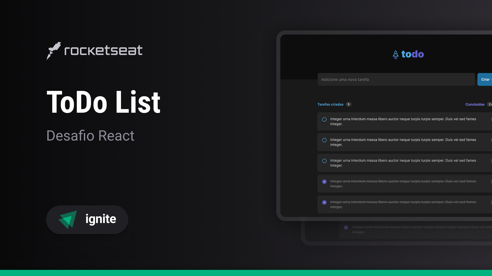

# React + TypeScript + Vite = What todo?

This simple project contains an example of a todo list that can be used to manage a daily routine.

___

## 💻 About

What todo? is a simple and straightforward solution to empower your productivity. This project includes technologies such as ReactJS, TypeScript, Phosphor-icons, and others.

___

## 🎨 Layout

The project layout is available on figma platform by clicking [HERE](https://www.figma.com/design/0n0zDN7zbzhRbaEO74Xesx/ToDo-List-%E2%80%A2-Desafio-React/duplicate?node-id=0-1).



___

## 🚀 Reusing the project

Clone the projeto to a local directory.

```bash
git clone https://github.com/jakunzler/rocketseat-react
```

Considering you are already in the repository's directory, you will find the files changing the directory two times under the name of `projeto01'.

```bash
cd projeto01
cd projeto01
```

___

### 🚧 Running the application

```bash
# Install dependencies
$ yarn

# Start the application
$ yarn dev
```

___

## Folder structure

```txt
projeto01/
├── node_modules/
│   └── ...
├── public/
├── src/
│   ├── assets/
│   │   └── ...
│   ├── components/
│   │   └── ...
│   ├── App.module.css
│   ├── App.tsx
│   ├── global.css
│   ├── index.css
│   ├── main.tsx
│   ├── vite-env.d.ts
├── .eslintrc.cjs
├── .gitignore
├── .index.html
├── package.json
├── README.md
├── tsconfig.json
├── vite.config.ts
└── yarn.lock
```

## 📝 License

This project is under the MIT license.

___

Made with 💜 by Jonas Augusto Kunzler 👋
